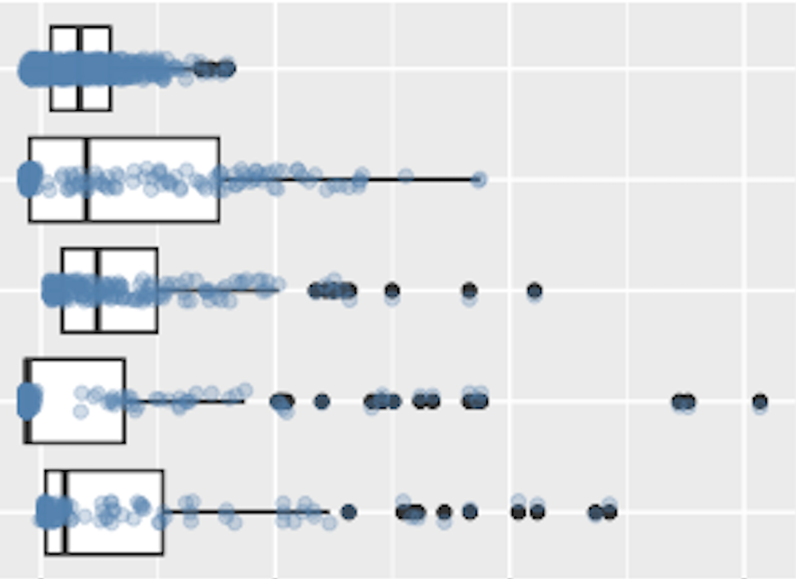

<!-- README.md is generated from README.Rmd. Please edit that file -->

```{r, include = FALSE}
knitr::opts_chunk$set(
  collapse = TRUE,
  comment = "#>",
  fig.path = "man/figures/README-",
  out.width = "100%"
)
```

# scoretable 

**scoretable** is a general-purpose R package for annotating and
visualizing observation-by-category score matrices. It helps you
transform prediction scores into actionable insights by automatically
assigning labels, aggregating scores, and creating visualizations.

While originally developed for **single-cell RNA-seq cell type
annotation**, scoretable works with any domain where you have:

-   **Rows** representing observations (cells, customers, patients,
    samples, etc.)

-   **Columns** representing prediction scores for different categories
    or outcomes

Features include

-   **Automatic Label Assignment** - Assign labels based on maximum
    scores with optional confidence thresholds

-   **Flexible Aggregation** - Aggregate observation-level scores to
    group-level summaries

-   **Publication-Ready Plots** - Visualize score distributions and
    signal-to-noise ratios

-   **Domain Agnostic** - Works with any score matrix structure

# Installation

Install the development version from GitHub:

```{r eval=FALSE}
# install.packages("devtools")
devtools::install_github("pcantalupo/scoretable")
```

# Quick Start

```{r}
library(scoretable)

# Show example data (single-cell RNA-seq scores)
head(esmax_scores_small, 1)
```

1.  Assign labels based on maximum scores

```{r}
pred <- add_labels_based_on_max(esmax_scores_small)
head(pred, 1)
```

2.  Visualize score distributions

```{r plotscores_example, fig.width=5, fig.height=3, out.width="50%"}
plot_scores_by_pred(pred)
```

3.  Examine signal vs noise

```{r plotsignal_example, fig.width=10, fig.height=3.5}
plot_signal_vs_noise(pred)
```

# Data Requirements

Your input score matrix should have:

-   **Numeric values** (prediction scores, probabilities, or similarity
    metrics)

-   **Row names** (observation identifiers)

-   **Column names** (category labels)

-   **Matrix or data.frame** format

Example structure:

```{r}
#                    TypeA    TypeB    TypeC
# observation_1      0.75     0.15     0.10
# observation_2      0.20     0.65     0.15
# observation_3      0.10     0.25     0.65
```

# Case Study: Single-Cell RNA-seq Cell Type Annotation

This example demonstrates a complete workflow for annotating cell types
in scRNA-seq data using the included `esmax_scores_small` dataset.

## About the Dataset

The `esmax_scores_small` dataset contains prediction scores from 1,000
randomly sampled cells from a retinal study. Each cell has been scored
against 5 potential cell types:

```{r}
library(scoretable)

# Examine structure of the example dataset
dim(esmax_scores_small)

colnames(esmax_scores_small)

head(esmax_scores_small, 3)
```

## Step 1: Assign Cell Type Labels

Assign each cell to its highest-scoring cell type:

```{r}
# Basic label assignment
pred <- add_labels_based_on_max(esmax_scores_small)

# Count cells per type
table(pred$labels)
```

## Step 2: Handle Low-Confidence Predictions

Mark cells with low prediction scores as "Unknown":

```{r}
# Assign "Unknown" to cells with max score < 0.25
pred_filtered <- add_labels_based_on_max(
  esmax_scores_small, 
  unknown = TRUE, 
  cutoff = 0.25
)

# How many cells were filtered? 
sum(pred_filtered$labels == "Unknown")
```

## Step 3: Visualize Score Distributions

Boxplot of Scores by Predicted Cell Type

```{r fig.width=5, fig.height=3, out.width="50%"}
plot_scores_by_pred(pred)
```

This plot shows the distribution of maximum scores for each predicted
cell type, helping you assess prediction confidence.

Ridge Plot Alternative

```{r fig.width=5, fig.height=3, out.width="50%"}
library(ggridges)
plot_scores_by_pred_ggridges(pred, alpha = 0.7, scale = 1.2)
```

## Step 4: Signal vs Noise Analysis

Examine how well each cell type separates from others:

```{r fig.width=10, fig.height=3.5}
# Faceted view showing all scores for each prediction
plot_signal_vs_noise(pred)
```

This visualization is important for understanding:

-   **Signal**: Scores for the predicted cell type (should be high)
-   **Noise**: Scores for other cell types (should be low)
-   **Separation**: Good predictions show clear separation between
    signal and noise

```{r eval=FALSE}
# Ridge plot version for smoother distributions (NOT RUN)
plot_signal_vs_noise_ggridges(pred, alpha = 0.6, scale = 0.9)
```

## Step 5: Aggregate to Cluster Level

If cells are organized into clusters, and you want to annotate your
clusters, first aggregate scores to the cluster level:

```{r fig.width=5, fig.height=3, out.width="50%"}
# Cluster IDs are in the esmax_clusters_small vector
clusters = esmax_clusters_small
table(clusters)

# Aggregate scores by cluster and assign labels at cluster level
cluster_scores <- scores_grouplevel(esmax_scores_small, clusters)
cluster_pred <- add_labels_based_on_max(cluster_scores)

# Visualize cluster-level predictions
plot_scores_by_pred(cluster_pred)
```

## Step 6: Map Cluster Labels Back to Cells

Transfer cluster-level annotations back to individual cells:

```{r}
# Expand cluster labels to cell level
cell_labels <- expand_group_labels(cluster_pred, clusters)
length(cell_labels)

# Example of adding cell_labels to your metadata
metadata <- data.frame(
  cell_id = rownames(esmax_scores_small),
  cluster = clusters,
  celltype = cell_labels
)

# Or add to your Seurat object
# seurat_obj$celltype = cell_labels

# Show that all cells from each cluster have the same assigned cell type
table(metadata$celltype, metadata$cluster)
```

# Customizing Plots

All plotting functions return `ggplot` objects that can be customized:

```{r fig.width=5, fig.height=3, out.width="50%"}
library(ggplot2)

# Customize labels and title
p = plot_scores_by_pred(pred) +
  ggtitle("Scores by Cell Type") +
  labs(x = "Cell Types", y = "Prediction Scores") 

# Add jitter to see individual points and show outliers
p + geom_boxplot(outlier.shape = 19) +
  geom_jitter(width = 0.1, alpha = 0.3, color = "steelblue")
```

# Functions

| Function | Description |
|--------------------------------|----------------------------------------|
| `add_labels_based_on_max()` | Assign labels based on maximum score per observation |
| `scores_grouplevel()` | Aggregate observation-level scores to group-level |
| `expand_group_labels()` | Map group-level labels back to observations |
| `plot_scores_by_pred()` | Boxplot of score distributions by predicted label |
| `plot_signal_vs_noise()` | Faceted boxplots showing all scores per prediction |
| `plot_scores_by_pred_ggridges()` | Ridge plot alternative for score distributions |
| `plot_signal_vs_noise_ggridges()` | Ridge plot alternative for signal vs noise |

# Related Packages

-   [Seurat](https://satijalab.org/seurat/) - Single-cell RNA-seq
    analysis
-   [SingleR](https://bioconductor.org/packages/SingleR/) - Cell type
    annotation reference
-   [scType](https://github.com/IanevskiAleksandr/sc-type) - Cell type
    annotation tool
